# Module 2 Virtualization and Cloud Basic. <br/>
### PART 1. HYPERVISORS <br/>
#### 1. What are the most popular hypervisors for infrastructure virtualization? <br/><br/>
 VMware ESXi/vSphere <br/>
 Microsoft Hyper-V <br/>
 Citrix XenServer <br/>
 Oracle VirtualBox <br/>
 Parallels Hypervisor <br/>
 Red Hat Enterprise Virtualization Hypervisor (REVH)<br/>
 KVM<br/>

   
#### 2. Briefly describe the main differences of the most popular hypervisors. <br/>
 Гіпервізори поділяються на 4 типи:<br/>
 Гіпервізор першого типу називають ще мікроядром, тонким гіпервізором, <br/> 
 який виконується на «голому залізі». Гіпервізор  першого типу найпростіше <br/> 
 сприймати як специфічну компактну операційну систему, яка встановлюється прямо <br/> 
 на залізо (bare-metal server) і має  основні ознаки ОС. До першого типу <br/>
 належать: Microsoft Hyper-V, VMware ESX Server, Citrix XenServer.<br/><br/>
 Гіпервізор другого типу називається хостовим і виступає шаром поверх<br/>
 операційної системи, повноваження гіпервізора значно скромніші:<br/> 
 він керує гостьовими операційними системами, а емуляцію і управління<br/>
 фізичними ресурсами перебирає хостова ОС.<br/> Найбільш популярні гіпервізори <br/>
 другого типу - Oracle VirtualBox, VMware Workstation, KVM. <br/>
Ще є тип 3 (Моноліт) і тип 4 (Мікрокернел), але вони зустрічаються значно <br/>
рідше і ми їх розглядати не будемо.


### PART 2. WORK WITH VIRTUALBOX

1. First run VirtualBox and Virtual Machine (VM).<br/>
   1.1 Get acquainted with the structure of the user manual VirtualBox [1] (see list ofreferences<br/> 
   in the end of the document)<br/>
   1.2 From the official VirtualBox site [2] download the latest stable version of VirtualBox
   according to the host operating system (OS) installed on the student's workplace. For Windows,
   the file may be called, for example, VirtualBox-6.1.10-138449-Win.exe. Install VirtualBox.<br/>
   1.3 Download the latest stable version of Ubuntu Desktop or Ubuntu Server from the
   official site [3].<br/>
   1.4 Create VM1 and install Ubuntu using the instructions [1, chapter 1.8]. Set machine
   name as "host machine name"_"student last name"<br/>
   1.5 Get acquainted with the possibilities of VM1 control -start, stop, reboot, save state,
   use Host key and keyboard shortcuts, mouse capture, etc. [1, ch.1.9].<br/>
   
```text
"В ході виконання завдань 1.0-1.5, було створено і протестовано віртуальну машину на операційній системі
 Ubuntu server з іменем  vm 1. скрінів не робив, тому що результат створення і роботи віртуальної машиини
 буде продемонстровано в подальших завданнях разом зі скрінами"
```
<br/><br/>
   1.6 Clone an existing VM1 by creating a VM2 [1, ch.1.14]. <br/><br/>
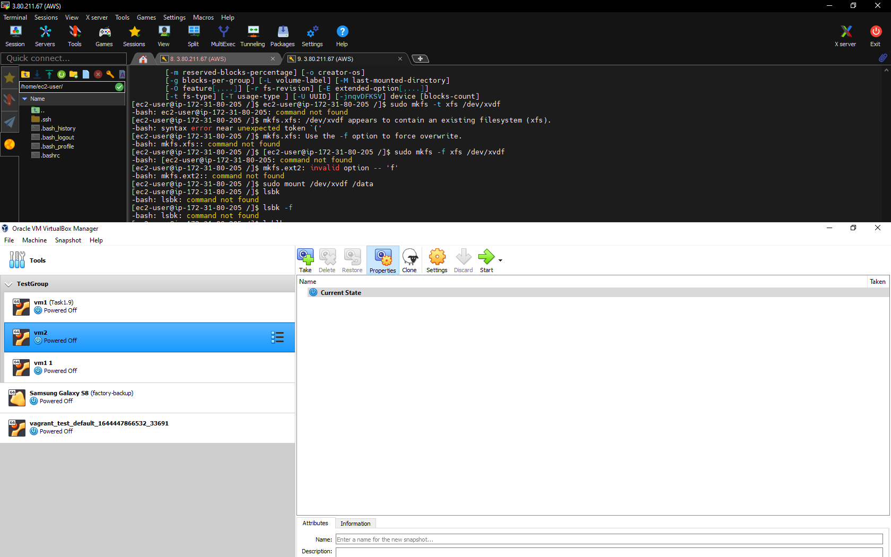 <br/><br/>
   1.7 Create a group of two VM: VM1, VM2 and learn the functions related to groups [1, ch.1.10]. <br/><br/>
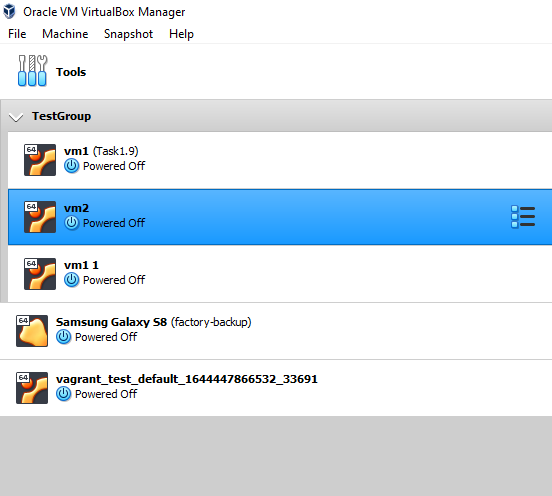 <br/><br/>
   1.8 For VM1, changing its state, take several different snapshots, forming a branched
tree of snapshots [1, ch.1.11].<br/>
   1.9 Export VM1. Save the *.ova file to disk. Import VM from *.ova file [1, ch.1.15]. <br/>

 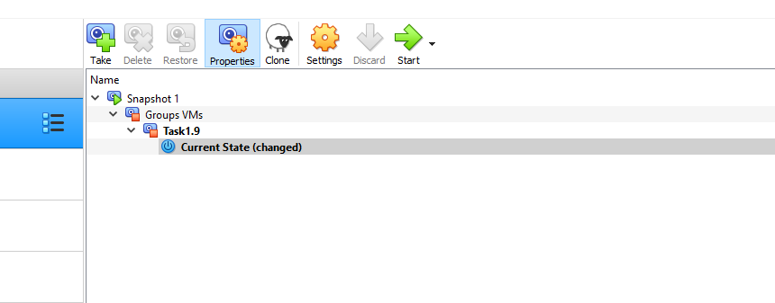 <br/><br/>

2. Configuration of virtual machines<br/>
   2.1 Explore VM configuration options (general settings, system settings, display,
   storage, audio, network, etc.).<br/>
   2.2 Configure the USB to connect the USB ports of the host machine to the VM
   [1, ch.3.11].<br/>
 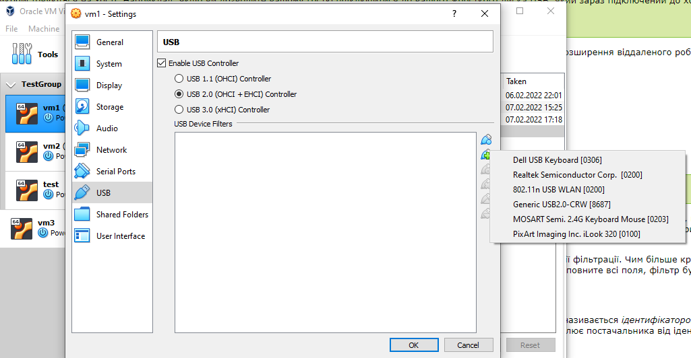 <br/><br/>
   2.3 Configure a shared folder to exchange data between the virtual machine and
   the host [1, ch.4.3].<br/>
   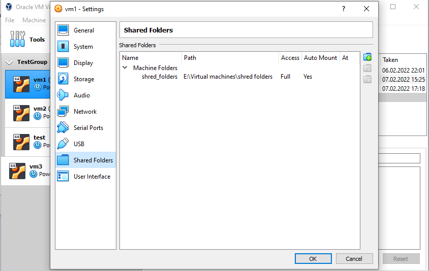 <br/><br/>
   2.4 Configure different network modes for VM1, VM2. Check the connection
   between VM1, VM2, Host, Internet for different network modes. You can use the ping
   command to do this. Make a table of possible connections.<br/>
   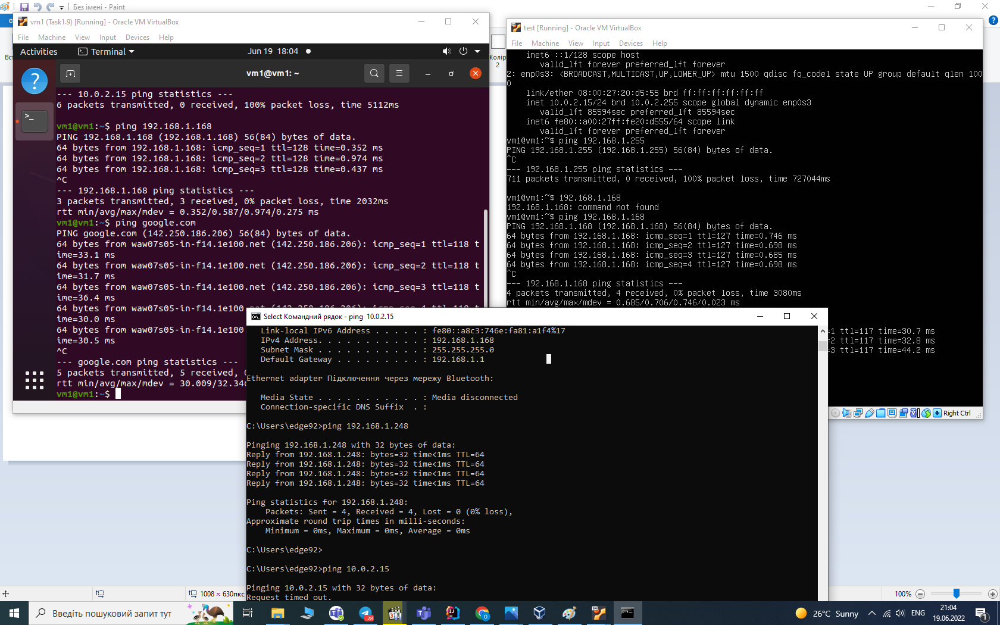 <br/><br/>
```text
Результати моїх тестів повністю збігаються з таблицею нижче:
```
  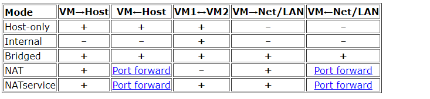 <br/><br/>

3. Work with CLI through VBoxManage. <br/>
   3.1 Run the cmd.exe command line. <br/>
   3.2 Examine the purpose and execute the basic commands of VBoxManage list,
   showvminfo, createvm, startvm, modifyvm, clonevm, snapshot, controlvm [1, ch.8]. <br/>

 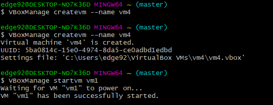 <br/><br/>
 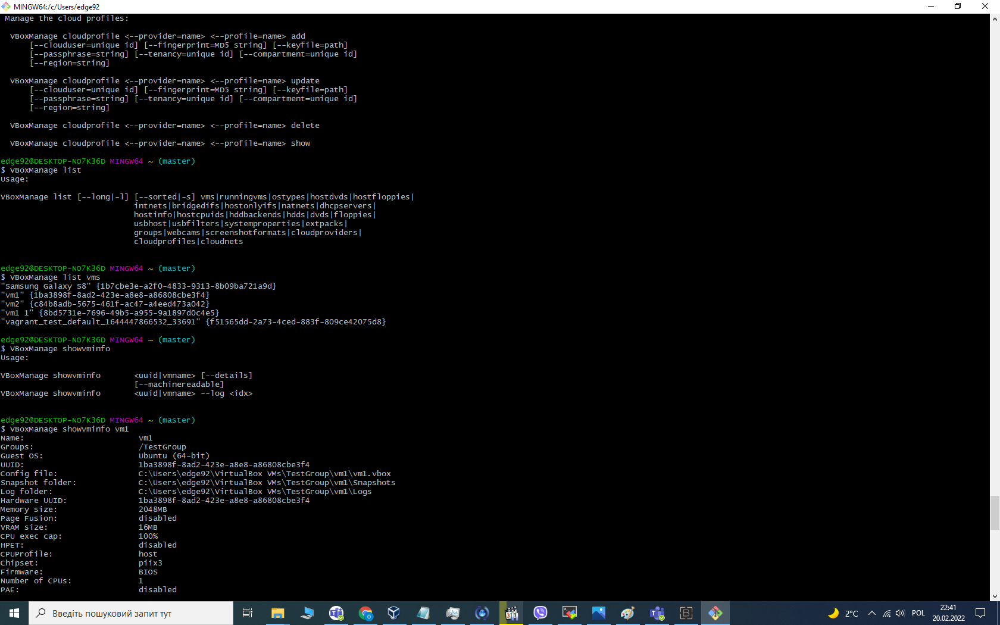 <br/><br/>
 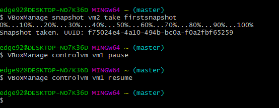 <br/><br/>
### PART 3. WORK WITH VAGRANT
1. Download the required version of Vagrant according to the instructions [5] and
   according to the host operating system (OS) installed on the student's workplace. For
   Windows, the file may be called, for example, vagrant_2.2.0_x86_64.msi. Install Vagrant.
   Check the path to Vagrant bin in the Path variable (My computer -> Properties ->
   Advanced system settings -> Advanced -> Environment Variables). <br/>
2. Run the powershell. Create a folder "student name" (in English). In this example,
   create a folder vagrant_test. Next, go to the folder. <br/>
3. Initialize the environment with the default Vagrant box: init hashicorp/precise64. <br/>
4. Run vagrant up and watch for messages during VM boot and startup. <br/>
   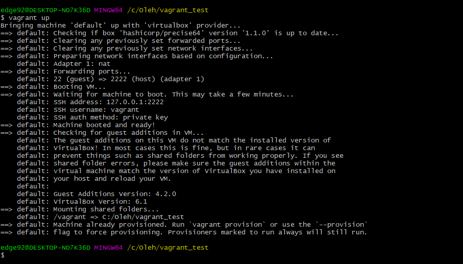 <br/><br/>
5. Connect to the VM using the program MobaXterm or PuTTY (can be
      downloaded from [6]), using SSH, IP address and port listed above (127.0.0.1:2222). By
      default, login - vagrant and password are also vagrant. <br/>
6. Record the date and time by executing the date command. <br/>
 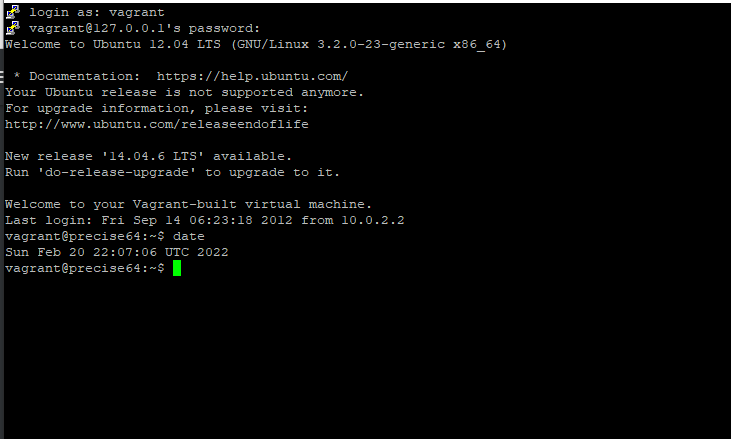 <br/><br/>
7. Stop and delete the created VM. <br/>
 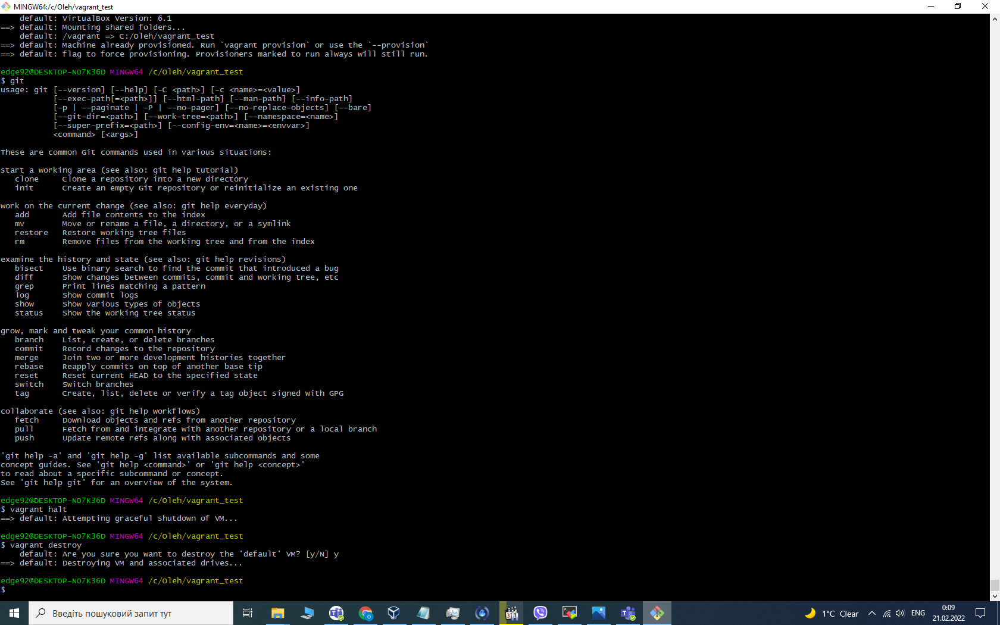 <br/><br/>
8. Create your own Vagrant box [7] <br/>
9. (optional) Create a test environment from a few servers. Servers' parameters
   are chosen independently by the student.><br/>