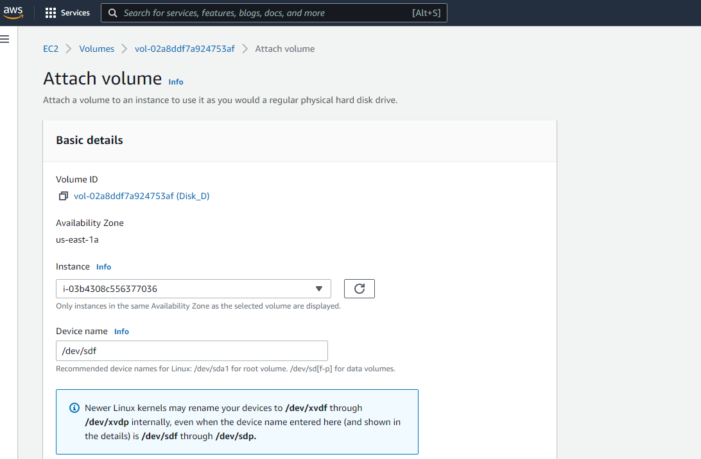

# Module 2 Virtualization and Cloud Basic.<br/>
### PART 2. Cloud Basic
1. Read the terms of Using the AWS Free Tier and the ability to control their own costs.<br/>
2. Register with AWS (first priority) or alternatively, you can request access to courses in AWS
   Academy if you are currently a student of certain University.<br/>
3. Find the hands-on tutorials and AWS Well-Architected Labs for your AWS needs. Explore list of
   step-by-step tutorials for deferent category. Use, repeat as many as you can and have fun))<br/>
4. Review Getting Started with Amazon EC2. Log Into Your AWS Account, Launch, Configure, Connect
   and Terminate Your Instance. Do not use Amazon Lightsail. It is recommended to use the t2 or
   t3.micro instance and the CentOS operating system.<br/><br/>
5. Create a snapshot of your instance to keep as a backup.<br/>


<br/><br/>

6. Create and attach a Disk_D (EBS) to your instance to add more storage space. Create and save
some file on Disk_D.<br/><br/>
<br/><br/>
7. Launch the second instance from backup.<br/><br/>
<br/><br/>
8. Detach Disk_D from the 1st instance and attach disk_D to the new instance.<br/><br/>
<br/><br/>
9. Review the 10-minute example. Explore the possibilities of creating your own domain and
   domain name for your site. Note, that Route 53 not free service. Alternatively you can free
   register the domain name *.PP.UA and use it.
<br/><br/>
10. Launch and configure a WordPress instance with Amazon Lightsail link
<br/><br/>
11. Review the 10-minute Store and Retrieve a File. Repeat, creating your own repository.
<br/><br/>
12. Review the 10-minute example Batch upload files to the cloud to Amazon S3 using the AWS CLI.
    Create a user AWS IAM, configure CLI AWS and upload any files to S3.
```text
C:\Users\edge92>aws s3 cp "E:\OBS.exe" s3://epamlubbucket/
upload: E:\OBS.exe to s3://epamlubbucket/OBS.exe
```
13. Review the 10-minute example Deploy Docker Containers on Amazon Elastic Container Service
    (Amazon ECS). Repeat, create a cluster, and run the online demo application or better other
    application with custom settings.
```text
[ec2-user@ip-172-31-83-233 ~]$ 46.219.231.99docker images --filter reference=hello-world
-bash: 46.219.231.99docker: command not found
[ec2-user@ip-172-31-83-233 ~]$ docker images --filter reference=hello-world
REPOSITORY    TAG       IMAGE ID       CREATED          SIZE
hello-world   latest    e2e4d65a769c   19 minutes ago   201MB
[ec2-user@ip-172-31-83-233 ~]$ docker run -t -i -p 80:80 hello-world
AH00558: apache2: Could not reliably determine the server's fully qualified domain name, using 172.17.0.2. Set the 'ServerName' directive globally to suppress this message
```
<br/><br/>
```text
[ec2-user@ip-172-31-83-233 ~]$ docker tag hello-world 343911933861.dkr.ecr.us-east-1.amazonaws.com/hello-repository
[ec2-user@ip-172-31-83-233 ~]$ aws ecr get-login-password | docker login --username AWS --password-stdin 343911933861.dkr.ecr.us-east-1.amazonaws.com
WARNING! Your password will be stored unencrypted in /home/ec2-user/.docker/config.json.
Configure a credential helper to remove this warning. See
https://docs.docker.com/engine/reference/commandline/login/#credentials-store

Login Succeeded
[ec2-user@ip-172-31-83-233 ~]$ docker push 343911933861.dkr.ecr.us-east-1.amazonaws.com/hello-repository
Using default tag: latest
The push refers to repository [343911933861.dkr.ecr.us-east-1.amazonaws.com/hello-repository]
a62327ff6b3b: Pushed
4650589eca44: Pushed
8367991a19e7: Pushed
95129a5fe07e: Pushed
latest: digest: sha256:2fb8aba8757e101b35a5bb263f3ea5d2bd117db0ceb32653ab5031dbc7c83e5d size: 1155
```
14. Run a Serverless "Hello, World!" with AWS Lambda.
15. Create a static website on Amazon S3, publicly available (link1 or link2 - using a custom domain
    registered with Route 53). Post on the page your own photo, the name of the educational
    program (EPAM DevOps online Winter 2022), the list of AWS services with which the student
    worked within the educational program or earlier and the full list with links of completed labs
    (based on tutorials or qwiklabs). Provide the link to the website in your report and СV.
```text
In progress ...
```