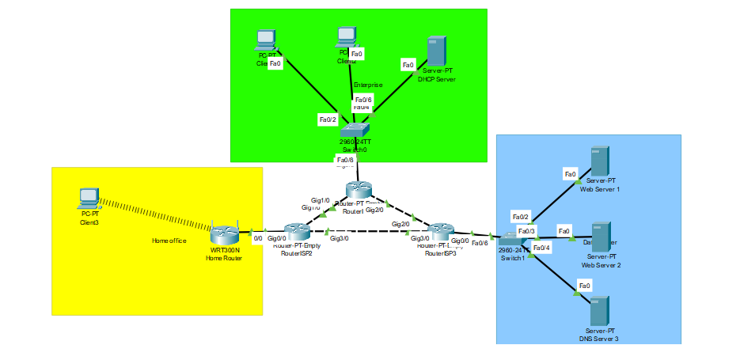
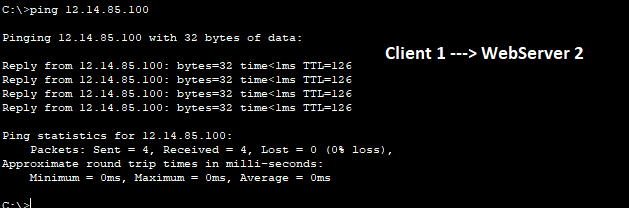
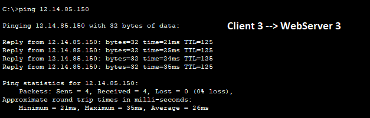
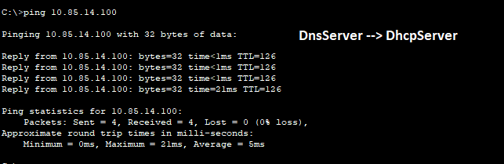

# Task 3.3.  

My work in this file -> [3.3.pkt](https://github.com/OlegG888/DevOps_online_Lviv_2022Q1Q2/raw/main/Module%203%20Networking%20fundamentals/Task3.3/3.3.pkt)  
 

3. Перевірити працездатність мережі за допомогою команди ping та tracert.
      Остання команда дозволить проконтролювати маршрут пакету.
    
    
    