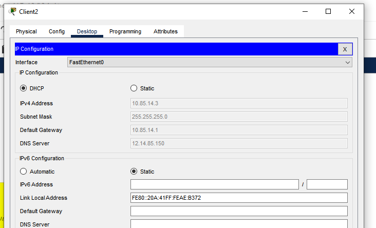

# Task 3.4.  

My work in this file -> [3.4.pkt](https://github.com/OlegG888/DevOps_online_Lviv_2022Q1Q2/raw/main/Module%203%20Networking%20fundamentals/Task3.4/3.4.pkt)  
 
   
Перевірити працездатність сервісу, поставивши в налаштуваннях Client 1 та
      Client 2 DHCP  
    
    
Перевірити працездатність шляхом відправки ping з Client на доменне ім’я.  
    