# Module 4 Linux Essentials <br/>
### Task1.Part1<br/>


1. Log in to the system as root (or sudo-er).
2. Use the passwd command to change the password. Examine the basic parameters of the command. What system file does it change ? (/etc/passwd)
   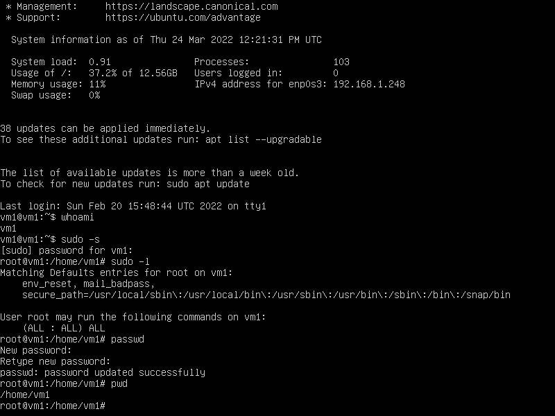 <br/><br/>
3. Determine  the  users  registered  in  the  system,  as  well  as what  commands  they execute. What additional information can be gleaned from the command execution?
```text
/etc/passwd - файл в якому міститься інформація в текстовому форматі список всіх користувачів/аккаунтів .
 Файл є основним джерелом інформації прав користувачів опреаційної системи (1.Імя (логін) користувача.
2. Зашифрований пароль. 3. Цифровий індетифікатор користувача UID. 4.Цифровий індетифікатор груп
користувачів GID. 5.Повне імя користувача Gecos. 6. Домашній каталог. 7. Оболочка входу (shell).
```
4. Change personal information about yourself.
   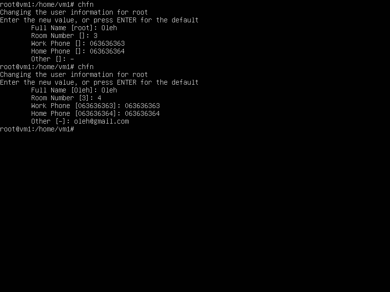 <br/><br/>
5. Become familiar with the Linux help system and the man and info commands. Get help on the previously discussed commands, define and describe any two keys for these commands. Give examples.
```text
man це традиційна форма допомоги для кожної команди системи і файлів конфігурації. Info це альтернативна система для представлення довідкових сторінок для команд, заснована на GNU emacs. 
Приклад ключа man passwd (скрін 5а) виводить загальну інформацію про команду  passwd. 
Приклад ключа info passwd (скрін 5b) показує таку ж і нформацію як man, але з можливістю переходу по гіперсилках.
```
 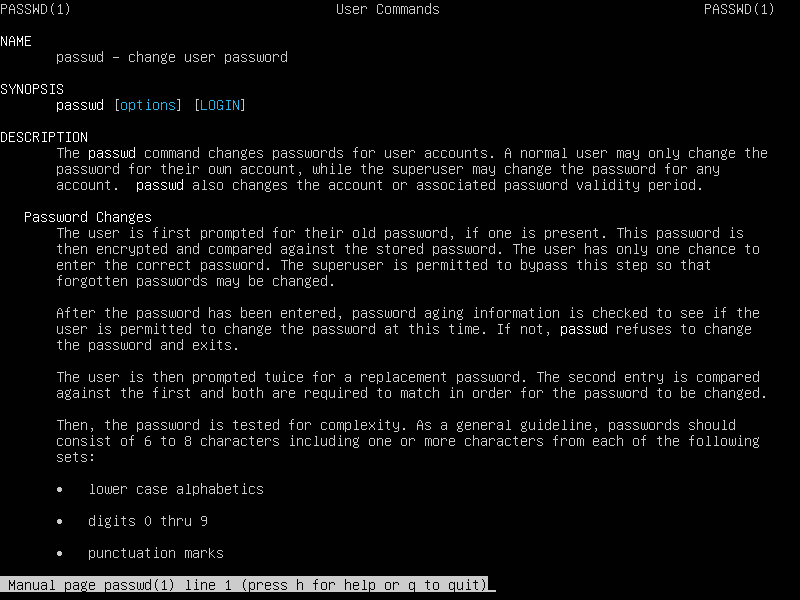 <br/>
 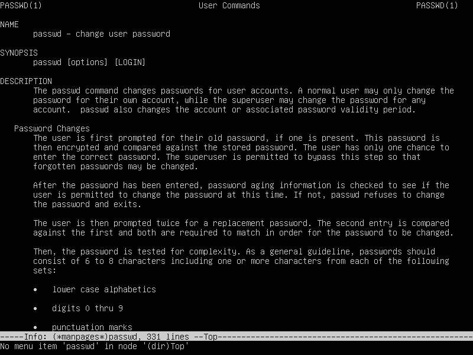 <br/><br/>
6. Explore the more and less commands using the help system. View the contents of files .bash* using commands.
```text
За допомогою команди "more" зручно переглядати великі текстові файли, відкриває файл де текст відображається з
самого початку і є індикатор прогресу прокрутки + зручна навігація. Команда "Less" більш зручніша за "more" тому 
що можна робити прокрутку не тільки вниз, а і вверх також. Також призначена для перегляду великих файлів і має 
гнучкішу навігацію. Про команду Less міститься інформація в довіднику "help" За ключем less --help.
```
 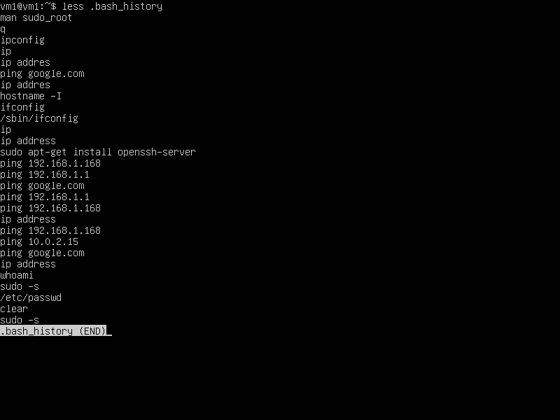 <br/><br/>

7. Determine  the  last  logon  time  for  all  users.Tip:  You  should  read  the documentation for the finger command.
```text
Команда Ls допамагає переглянути вміст папки, або вміст будь якої іншої папки шлях до якої ми вкажемо в ключі.
```
8. List the contents of the home directory using the ls command, define its files and  directories.  Hint:  Use  the  help  system  to  familiarize  yourself  with  the  ls command.

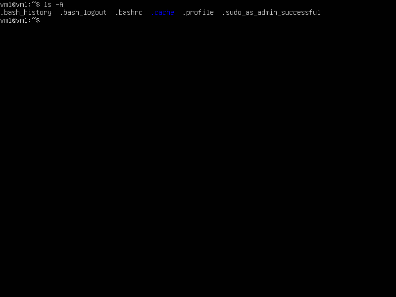 <br/><br/>

### Task1.Part2

1. Examine  the tree command.  Master  the  technique  of  applying  a  template,  for example, display all files that contain a character c, or files that contain a specific sequence of characters. List subdirectories of the root directory up to and including the second nesting level.<br/>
   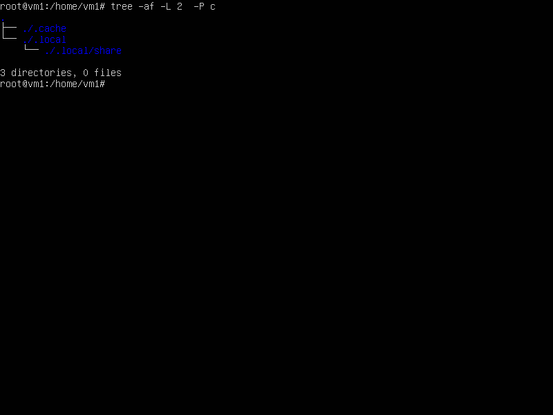 <br/><br/>
2. What command can be used to determine the type of file (for example, text or binary)? Give an example.<br/>
   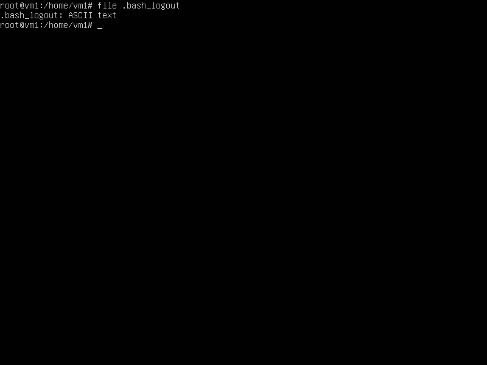 <br/><br/>
3. Master the skills of navigating the file system using relative and absolute paths. How can you go back to your home directory fromanywhere in the filesystem?<br/>
   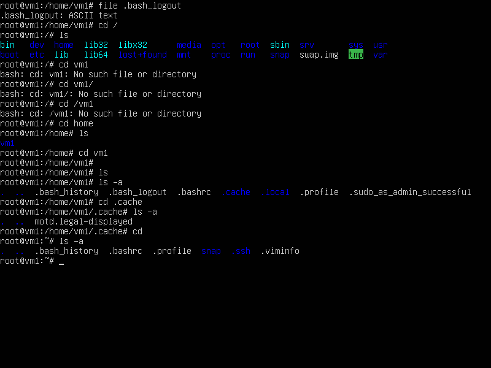 <br/><br/>
4. Become familiar with the various options for the ls command. Give examples of listing  directories  using  different  keys.  Explain  the  information  displayed  on  the terminal using the -l and -a switches.<br/>
 ```text
Команда ls з ключом -а показує скорочений список файлів і папок, які відображаються в рядок. Натомість з ключом -l
операційна система відображає папки і файли також приховані обєкти і права доступу до них, час створення і розмір. 
```  

  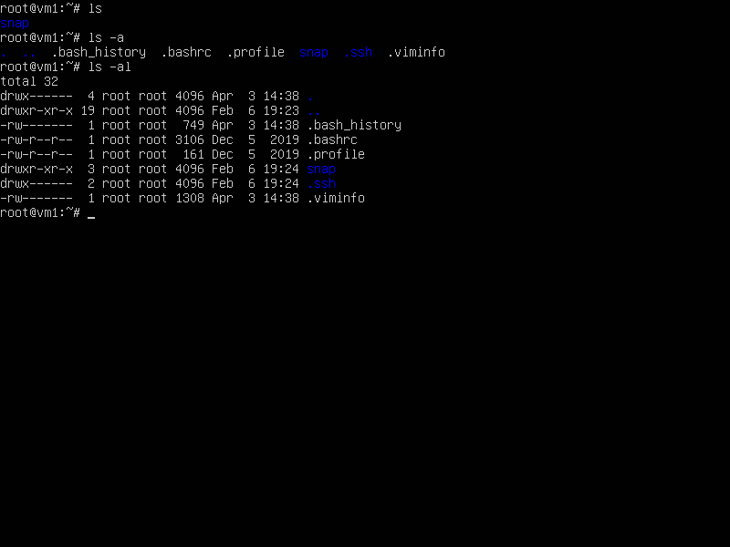 <br/><br/>
 5. Perform the followingsequence of operations:-create a subdirectory in the home directory;-in this subdirectory create a file containing information 
about directories located in the root directory (using I/O redirection operations);-view the created file;-copy the created file to your home directory 
using relative and absolute addressing.-delete the previously created subdirectory with the file requesting removal;
-delete the file copied to the home directory.<br/>
 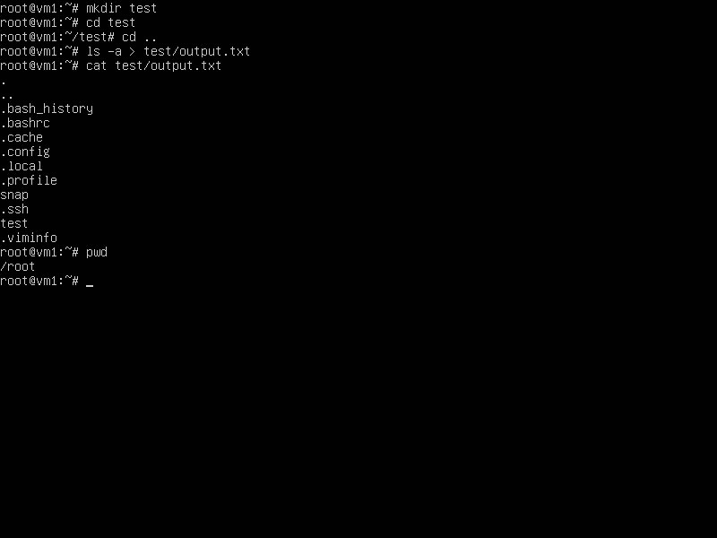 <br/>
 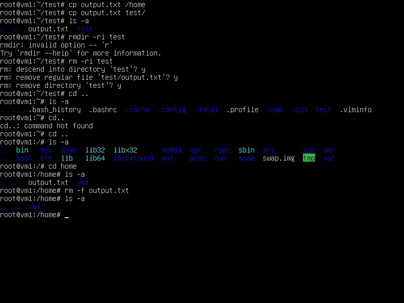 <br/><br/>
 6. Perform the following sequence of operations:-createa subdirectory test in the home directory;-copy  the .bash_history file  to  this  directory  
while  changing  its  name  tolabwork2;-create a hard and soft link to the labwork2 file in the test subdirectory;
-how to define soft and hard link, what do theseconcepts;-change the data by opening a symbolic link. What changes will
happen andwhy-rename the hard link file to hard_lnk_labwork2;-rename the soft link file to symb_lnk_labwork2 file;-then delete
the labwork2. What changes have occurred and why?

```text
 За допомогою rоманди "mkdir" створюємо папку test.
-командою sudo cp... ми копіюємо файл .bash_history і присвоюємо назву labwork2.
-Командою ln -s створюємо символічне (мяке) посилання на файл labwork2.txt. Завдяки простій команді ln (без ключів) створюємо жостке посилання.
-щоб визначити чи посилання мяке, або жорстке треба ввести команду ls -il жорстке посилання має однаковий номер inod з оригіналом. 
Мяке посилання відзначається стрілкою на оригінал. Якщо видалити оригінал, мяке посилання буде не робочим, в цей час жорстке посилання збереже дані.
-Змінивши данні в файлі мякого посилання змінюються також данні в оригіналі, бо це ярлик.
-Командою sudo mv hardlink.txt hard_lnk_labwork2.txt -ми перейменовуємо файл жорсткого посилання, таким самим чином перейменовуєм мяке посилання.
```

  <br/><br/>
 7. Using  the  locate  utility,  find  all  files  that  contain  the  squid  and  traceroutesequence.<br/>
 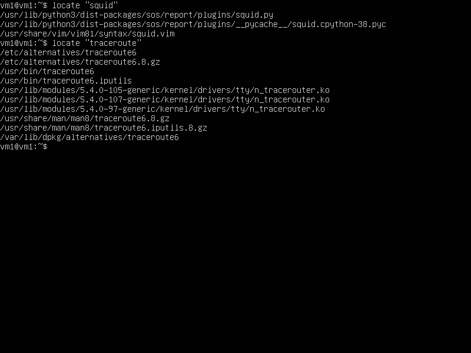 <br/><br/>
 8. Determine  which  partitions  are  mounted  in  the  system,  as  well  as  the  types  ofthese partitions.<br/>
 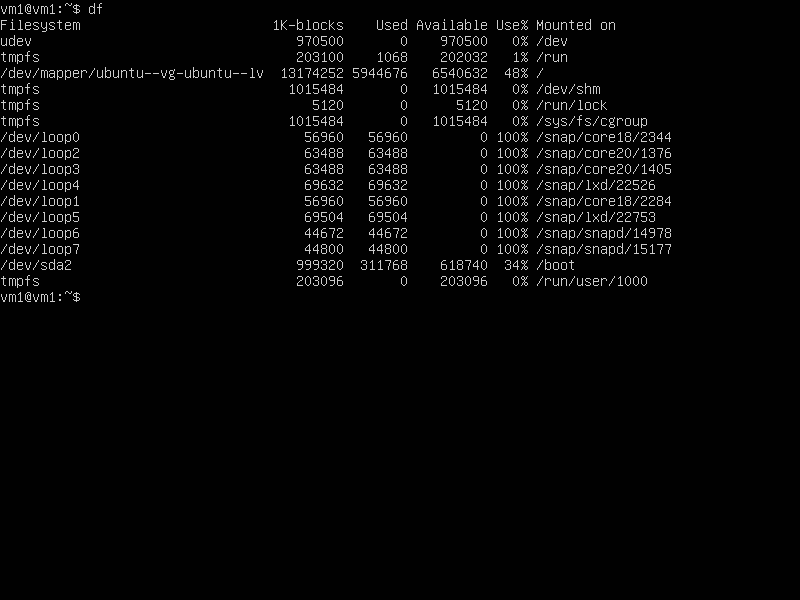 <br/><br/>
 9. Count the number of lines containing a given sequence of characters in a givenfile.<br/>
  <br/><br/>
 10. Using the find command, find all files in the /etc directory containing thehost character sequence.<br/>
 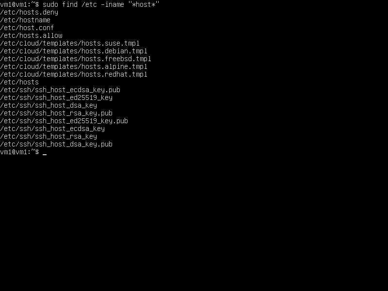 <br/><br/>
 11. List all objects in /etc that contain the ss character sequence. How can Iduplicate a similar command using a bunch of grep?<br/>
 ```text
Перебуваючи в цільовій папці ми можемо знайти потрібні файли за допомогою команди grep -ri ss.
```
 12. Organize a screen-by-screen print of the contents of the /etc directory. Hint:You must use stream redirection operations.<br/>
  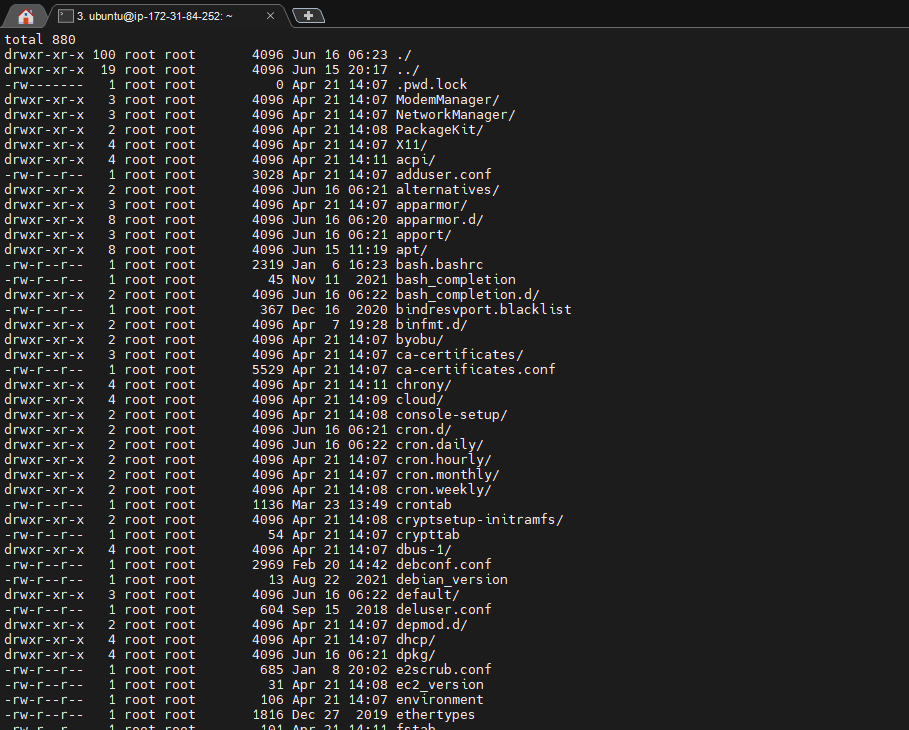 <br/><br/>
 13. What are the types of devices and how to determine the type of device? Giveexamples.<br/>
 Девайси поділяються на 2 типи: Символьні і блочні. Приклад нижче.  
```text
ubuntu@ip-172-31-84-252:~$ ls -l /dev | grep ^c | head -5 # character devices
crw-r--r-- 1 root root     10, 235 Jun 15 20:22 autofs
crw------- 1 root root     10, 234 Jun 15 20:17 btrfs-control
crw--w---- 1 root tty       5,   1 Jun 15 20:22 console
crw------- 1 root root     10, 123 Jun 15 20:22 cpu_dma_latency
crw------- 1 root root     10, 203 Jun 15 20:17 cuse
ubuntu@ip-172-31-84-252:~$ ls -l /dev | grep ^b | head -5 # block devices
brw-rw---- 1 root disk      7,   0 Jun 15 20:22 loop0
brw-rw---- 1 root disk      7,   1 Jun 15 20:22 loop1
brw-rw---- 1 root disk      7,   2 Jun 15 20:22 loop2
brw-rw---- 1 root disk      7,   3 Jun 15 20:22 loop3
brw-rw---- 1 root disk      7,   4 Jun 15 20:22 loop4

```
<br/><br/>
14. How to determinethe type of file in the system, what types of files are there?<br/>
```text
ubuntu@ip-172-31-84-252:~$ file data-dump.sql
data-dump.sql: ASCII text
ubuntu@ip-172-31-84-252:~$ file .lesshst
.lesshst: ASCII text
ubuntu@ip-172-31-84-252:~$ file .cache
.cache: directory

```
<br/><br/>
15. * List the first 5 directory files that were recently accessed in the /etcdirectory.
```text
ubuntu@ip-172-31-84-252:~$ ls -ltu /etc/ | head -n5
total 872
-rw-r--r-- 1 root root        857 Jun 20 11:17 group
-rw-r--r-- 1 root root       1879 Jun 20 11:17 passwd
-rw-r----- 1 root shadow      986 Jun 20 11:17 shadow
-rw-r--r-- 1 root root        111 Jun 20 11:10 magic

```