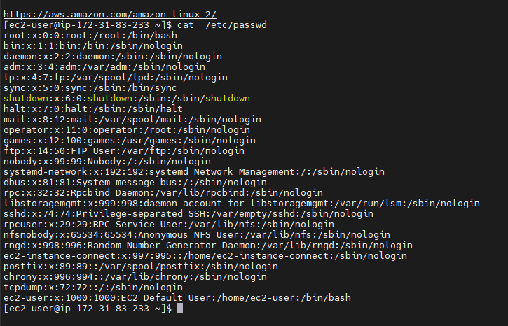
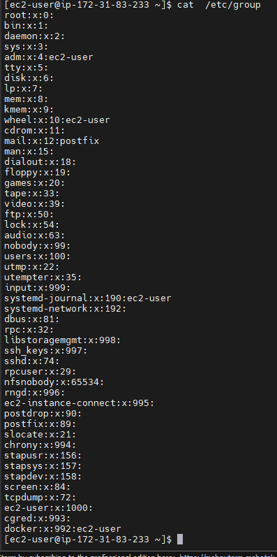
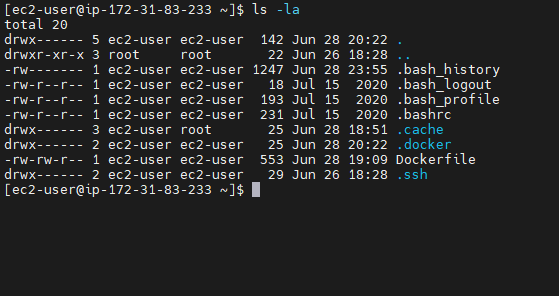

# Task 4.2. <br/>

 1) Analyze the structure of the /etc/passwd and /etc/group file, what fields are
present in it, what users exist on the system? Specify several pseudo-users, how to
define them?<br/><br/>
```text
File /etc/passwd contain infomation about: User_id, Group_id, User_id_info (description field),
 home_directory, users_shel.
```
<br/>
```text
The "/etc/group " file applies to the general security scheme for Unix-like systems: user,
 group, and file access.
 
```


<br/>
```text
These two files contain information about both real and pseudo-users. The most common pseudo-users:

 daemon (used by system service processes)
 bin (gives ownership of executables command)
 adm (owns registration files)
 nobody (used by many services)
 sshd (used by the secure shell server)
Pseudo-users have UID range from 1 to 999. Also, we can identify pseudo-users by looking at the last
field of the line. It typically contains “/usr/sbin/nologin” or “/bin/false”. When real users often have access to a shell (”/bin/bash”).

```
<br/>

2) What are the uid ranges? What is UID? How to define it?
```text
UID - user identifier. The UID, along with the group identifier (GID) and other access control criteria, is used to determine which system
resources a user can access. 
Available UIDs are usually splitted into two ranges:
1-999 – for system users (pseudo-users). These are users that do not map to actual “human” users, but are used as security identities for system daemons, to implement privilege separation and run system daemons with minimal privileges.
1000-65533 and 65536-4294967294 – for everything else, including regular users.
The root user has the UID of 0. We can determine UID and GID by looking at the "/etc/passwd" file.
```
3) What is GID? How to define it?
```text
GID is the group identifier. Like UID, GID 0 is reserved for root group, the first 100 UIDs are reserved for system use.
```
<br/>

4) How to determine belonging of user to the specific group?
```text
By using comand "groups username" we can figure out it.
[ec2-user@ip-172-31-83-233 ~]$ groups ec2-user
ec2-user : ec2-user adm wheel systemd-journal docker
```
<br/>

5) What are the commands for adding a user to the system? What are the basic
   parameters required to create a user?
```text
The command are useradd and adduser utilities. adduser is user-friendly utility for Debian/Ubuntu, useradd is more low level.

Here are some important parameters for useradd:

-G - specify groups
-m - create home directory
-d - specify home directory
-u - specify UID
-g - specify specific initial login group
-s - specify shell


```
<br/>

6) How do I change the name (account name) of an existing user?
```text
[ec2-user@ip-172-31-83-233 ~]$ usermod -l oleg ec2-user
```
<br/>

7) What is skell_dir? What is its structure?
```text
Skell_dir is used to generate a new home directory for user.
When creating a new user, this option is only valid if the -m (or --create-home) option is specified. 
If this option is not set, the skeleton directory is defined by the SKEL variable in /etc/default/useradd 
or, by default, /etc/skel.
```
<br/>

8) How to remove a user from the system (including his mailbox)?
```text
userdel -r username
```
<br/>

9) What commands and keys should be used to lock and unlock a user account?
```text
There are two ways to lock user from command line:

passwd -l username
usermod -l username
and unlock:

passwd -u username
usermod -U username
```
<br/>

10) How to remove a user's password and provide him with a password-free login
    for subsequent password change?
```text
passwd -d [username]
```
<br/>

11) Display the extended format of information about the directory, tell about the
    information columns displayed on the terminal.


```text
Access rights, permissions, rows the number of hard-links for the inode*, user, group, size of the file,
date of the last change, name of the file.
```
12) What access rights exist and for whom (i. e., describe the main roles)? Briefly
        describe the acronym for access rights.
```text
For example:
[ec2-user@ip-172-31-83-233 ~]$ ls -la
total 20
drwx------ 5 ec2-user ec2-user  142 Jun 28 20:22 .
drwxr-xr-x 3 root     root       22 Jun 26 18:28 ..
-rw------- 1 ec2-user ec2-user 1569 Jul  1 00:40 .bash_history
-rw-r--r-- 1 ec2-user ec2-user   18 Jul 15  2020 .bash_logout
-rw-r--r-- 1 ec2-user ec2-user  193 Jul 15  2020 .bash_profile
-rw-r--r-- 1 ec2-user ec2-user  231 Jul 15  2020 .bashrc
drwx------ 3 ec2-user root       25 Jun 28 18:51 .cache
drwx------ 2 ec2-user ec2-user   25 Jun 28 20:22 .docker
-rw-rw-r-- 1 ec2-user ec2-user  553 Jun 28 19:09 Dockerfile
drwx------ 2 ec2-user ec2-user   29 Jun 26 18:28 .ssh

The access rights are rwxr-wrx-xr so we have 3 blocks:
 rwx - the owner can read, write and execute;
 wrx - the group members can write, read and execute;
  xr - means that everyone else can read and execute as well.
```
13) What is the sequence of defining the relationship between the file and the user?
```text
The first three characters are the rights for the user, second three - for the group, and the third three - for others.
```
14) What commands are used to change the owner of a file (directory), as well as
    the mode of access to the file? Give examples, demonstrate on the terminal.
```text
The "chown" command changes the owner,and "сhmod" changes the rights.
```
15) What is an example of octal representation of access rights? Describe the
        umask command.
```text
For example:
0 000 ---
1 001 --x
2 010 -w-
3 011 -wx
4 100 r--
5 101 r-x
6 110 rw-
7 111 rwx
rwxrw-r-- 1 Oleg
111 110 100 - Binary system
764 - octal system

Command "umask" defines defolts permissions for newly created files/directories
```
16) Give definitions of sticky bits and mechanism of identifier substitution. Give
    an example of files and directories with these attributes.
```text
A Sticky bit is a permission bit that is set on a file or a directory that lets only the owner of the file/directory or
the root user to delete or rename the file. No other user is given privileges to delete the file created by some other user.
Example:
vm3@servervm3:~$ mkdir test
vm3@servervm3:~$ ls -la
drwxrwxr-x 2 vm3  vm3  4096 Jul  1 21:40 test
vm3@servervm3:~$ chmod +t test
vm3@servervm3:~$ ls -la
drwxrwxr-t 2 vm3  vm3  4096 Jul  1 21:40 test

```
17) What file attributes should be present in the command script?
```text
In the command script file attributes x should be presented
```