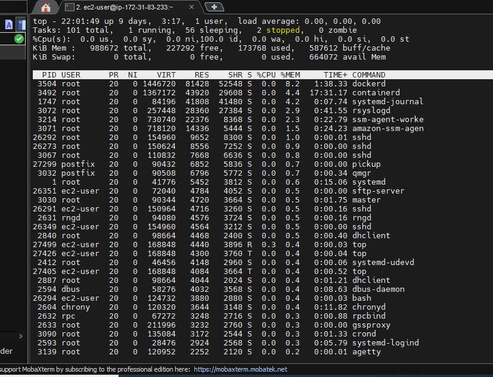

# Task 4.3. <br/>
## Part 1 <br/>
1. How many states could has a process in Linux?
```text
Linux has 5 states of process:

'D' = UNINTERRUPTABLE_SLEEP
'R' = RUNNING & RUNNABLE
'S' = INTERRRUPTABLE_SLEEP
'T' = STOPPED
'Z' = ZOMBIE
```
2. Examine the pstree command. Make output (highlight) the chain (ancestors) of the current
   process.
```text
pstree shows running processes as a tree.
```


3. What is a proc file system?
```text
Proc file system (procfs) is virtual file system created on fly when system boots and is
dissolved at time of system shut down. It contains useful information about the processes 
that are currently running, it is regarded as control and information center for kernel.
```
4. Print information about the processor (its type, supported technologies, etc.).
```text
[ec2-user@ip-172-31-83-233 ~]$ cat /proc/cpuinfo
processor       : 0
vendor_id       : GenuineIntel
cpu family      : 6
model           : 63
model name      : Intel(R) Xeon(R) CPU E5-2676 v3 @ 2.40GHz
stepping        : 2
microcode       : 0x46
cpu MHz         : 2400.193
cache size      : 30720 KB
physical id     : 0
siblings        : 1
core id         : 0
cpu cores       : 1
apicid          : 0
initial apicid  : 0
fpu             : yes
fpu_exception   : yes
cpuid level     : 13
wp              : yes
flags           : fpu vme de pse tsc msr pae mce cx8 apic sep mtrr pge mca cmov pat pse36 clflush mmx fxsr sse sse2 ht syscall nx rdtscp lm constant_tsc rep_good nopl xtopology cpuid tsc_known_freq pni pclmulqdq ssse3 fma cx16 pcid sse4_1 sse4_2 x2apic movbe popcnt tsc_deadline_timer aes xsave avx f16c rdrand hypervisor lahf_lm abm cpuid_fault invpcid_single pti fsgsbase bmi1 avx2 smep bmi2 erms invpcid xsaveopt
bugs            : cpu_meltdown spectre_v1 spectre_v2 spec_store_bypass l1tf mds swapgs itlb_multihit
bogomips        : 4800.01
clflush size    : 64
cache_alignment : 64
address sizes   : 46 bits physical, 48 bits virtual
```
5. Use the ps command to get information about the process. The information should be as
follows: the owner of the process, the arguments with which the process was launched for
execution, the group owner of this process, etc.
```text
[ec2-user@ip-172-31-83-233 ~]$ ps -af
UID        PID  PPID  C STIME TTY          TIME CMD
ec2-user 26382 26294  0 17:18 pts/0    00:00:00 ps -af

```
6. How to define kernel processes and user processes?
```text
User-space processes have its own virtual address space. Kernel processes
or threads do not have their own address space, they operate within kernel
address space only. And they may be started before the kernel has started 
any user process.
```
7. Print the list of processes to the terminal. Briefly describe the statuses of the processes.
   What condition are they in, or can they be arriving in?
```text
[ec2-user@ip-172-31-83-233 ~]$ ps aux | head
USER       PID %CPU %MEM    VSZ   RSS TTY      STAT START   TIME COMMAND
root         1  0.0  0.5  41776  5452 ?        Ss   Jun28   0:14 /usr/lib/systemd/systemd --switched-root --system --deserialize 21
root         2  0.0  0.0      0     0 ?        S    Jun28   0:00 [kthreadd]
root         3  0.0  0.0      0     0 ?        I<   Jun28   0:00 [rcu_gp]
root         4  0.0  0.0      0     0 ?        I<   Jun28   0:00 [rcu_par_gp]
root         6  0.0  0.0      0     0 ?        I<   Jun28   0:00 [kworker/0:0H-ev]
root         9  0.0  0.0      0     0 ?        I<   Jun28   0:00 [mm_percpu_wq]
root        10  0.0  0.0      0     0 ?        S    Jun28   0:00 [rcu_tasks_rude_]
root        11  0.0  0.0      0     0 ?        S    Jun28   0:00 [rcu_tasks_trace]
root        12  0.0  0.0      0     0 ?        S    Jun28   0:01 [ksoftirqd/0]

"R (running)",           
        "S (sleeping)",          
        "D (disk sleep)",       
        "T (stopped)",         
        "t (tracing stop)",     
        "X (dead)",            
        "Z (zombie)",          
        "P (parked)",           
 "I is TASK_REPORT_IDLE, which is returned from kernel guts (function __get_task_state) when process has status TASK_IDLE"
```


8. Display only the processes of a specific user.
```text
[ec2-user@ip-172-31-83-233 ~]$ ps -fu ec2-user
UID        PID  PPID  C STIME TTY          TIME CMD
ec2-user 26291 26273  0 17:09 ?        00:00:00 sshd: ec2-user@pts/0
ec2-user 26294 26291  0 17:09 pts/0    00:00:00 -bash
ec2-user 26349 26292  0 17:09 ?        00:00:00 sshd: ec2-user@notty
ec2-user 26351 26349  0 17:09 ?        00:00:00 /usr/libexec/openssh/sftp-server
ec2-user 27301 26294  0 21:15 pts/0    00:00:00 ps -fu ec2-user
```

9. What utilities can be used to analyze existing running tasks (by analyzing the help for the ps
   command)?
```text
ps' man page suggests to check pgrep, pstree, top, proc commands.
```
10. What information does top command display?
```text
top - 21:29:35 up 9 days,  2:45,  1 user,  load average: 0.00, 0.00, 0.00
Tasks:  99 total,   1 running,  56 sleeping,   0 stopped,   0 zombie
%Cpu(s):  0.3 us,  0.0 sy,  0.0 ni, 99.7 id,  0.0 wa,  0.0 hi,  0.0 si,  0.0 st
KiB Mem :   988672 total,   229096 free,   171992 used,   587584 buff/cache
KiB Swap:        0 total,        0 free,        0 used.   665852 avail Mem

  PID USER      PR  NI    VIRT    RES    SHR S %CPU %MEM     TIME+ COMMAND
 3492 root      20   0 1367172  43920  29608 S  0.3  4.4  17:28.60 containerd
 3504 root      20   0 1446720  81428  52548 S  0.3  8.2   1:38.13 dockerd
27323 ec2-user  20   0  168848   4304   3760 R  0.3  0.4   0:00.05 top
    1 root      20   0   41776   5452   3812 S  0.0  0.6   0:15.01 systemd
    2 root      20   0       0      0      0 S  0.0  0.0   0:00.04 kthreadd
    3 root       0 -20       0      0      0 I  0.0  0.0   0:00.00 rcu_gp
    4 root       0 -20       0      0      0 I  0.0  0.0   0:00.00 rcu_par_gp
    6 root       0 -20       0      0      0 I  0.0  0.0   0:00.00 kworker/0:0H-ev
    9 root       0 -20       0      0      0 I  0.0  0.0   0:00.00 mm_percpu_wq

```
The command provides a dynamic real-time view of a running system. It can display system 
summary information as well as a list of processes or threads currently being managed by the Linux kernel. summary information as well as a list of processes or threads currently being managed by the Linux kernel. <br/>


11. Display the processes of the specific user using the top command.
```text
top -u "some_user"
```
12. What interactive commands can be used to control the top command? Give a couple of
    examples.
```text
Shift+N to sort by PID;
Shift+P to sort by CPU usage;
Shift+M to sort by Memory usage;
Shift+T to sort by Time usage;
Shift+Z to change colors;
C to display absolute path of command;
```
13. Sort the contents of the processes window using various parameters (for example, the
    amount of processor time taken up, etc.) <br/>
Processes sorted by the memory and time usage. <br/>
     
14. Concept of priority, what commands are used to set priority?
```text

[ec2-user@ip-172-31-83-233 ~]$ sudo renice -n 10 -p 1
1 (process ID) old priority 0, new priority 10
[ec2-user@ip-172-31-83-233 ~]$

All the processes in Linux are started with a specific priority. By default, all regular processes are started with the
priority equal to 20. You can change the priority using the nice and renice commands.

- nice if you want to start a process with an adjusted priority.
- renice to change the priority for a currently active process.

When using nice or renice, we can select from priority values ranging from -20 to 19. The default niceness of a process
is set to 0 (which results in the priority value of 20). By applying a negative niceness, you increase the priority. Use a positive niceness to decrease the priority. It is a good idea to use increments of 5 and see how it gradually affects the application.
```
15. Can I change the priority of a process using the top command? If so, how?
```text
 For example:
 
  1 root      30  10   41776   5452   3812 S  0.0  0.6   0:15.69 systemd
[ec2-user@ip-172-31-83-233 ~]$ sudo renice -n -5 -p 1
1 (process ID) old priority 10, new priority -5
 After used command:
1 root      15  -5   41776   5452   3812 S  0.0  0.6   0:15.69 systemd

```
16. Examine the kill command. How to send with the kill command process control signal? Give
    an example of commonly used signals.
```text
kill syntax:

kill PID;
kill -s signalname PID;
kill -signalname PID;
kill -signalnumber PID.

The kill command is used to send a signal to a process. The most common use is when we need to stop a process. To do this, we can use: kill PID command. The command sends the SIGTERM signal to the process, which normally causes the process to stop its activity.

Sometimes the kill command does not work because the process we want to kill is busy. In that case, we can use kill -9 PID to send the SIGKILL signal to the process. The SIGKILL signal cannot be ignored, so it forces the process to stop, but we also risk losing data while using this command.

Some of the most common signals:

SIGTERM (15) to ask a process to stop.
SIGKILL (9) to force a process to stop.
The SIGHUP (1) to hang up a process resulting in rereading the configuration files of the process. This signal is useful after making modifications to a process configuration file.
```
17. Commands jobs, fg, bg, nohup. What are they for? Use the sleep, yes command to demonstrate the process control 
mechanism with fg, bg.
```text
jobs - lists the active jobs.
fg - moves a job to the foreground.
bg - moves a job to the background.
nohup - allows jobs to continue after logout. We can stop nohup process using kill

For example:
[ec2-user@ip-172-31-83-233 ~]$ yes > /dev/null &
[1] 30947
[ec2-user@ip-172-31-83-233 ~]$ sleep 20000 &
[2] 30948
[ec2-user@ip-172-31-83-233 ~]$ sleep 5000 &
[3] 30950
[ec2-user@ip-172-31-83-233 ~]$ jobs
[1]   Running                 yes > /dev/null &
[2]-  Running                 sleep 20000 &
[3]+  Running                 sleep 5000 &
[ec2-user@ip-172-31-83-233 ~]$ fg 2
sleep 20000

[2]+  Stopped                 sleep 20000
[ec2-user@ip-172-31-83-233 ~]$ jobs
[1]   Running                 yes > /dev/null &
[2]+  Stopped                 sleep 20000
[3]-  Running                 sleep 5000 &
[ec2-user@ip-172-31-83-233 ~]$ bg 2
[2]+ sleep 20000 &
[ec2-user@ip-172-31-83-233 ~]$ jobs
[1]   Running                 yes > /dev/null &
[2]-  Running                 sleep 20000 &
[3]+  Running                 sleep 5000 &
[ec2-user@ip-172-31-83-233 ~]$

```
## Part 2 <br/>
1. Check the implementability of the most frequently used OPENSSH commands in the MS
   Windows operating system. (Description of the expected result of the commands +screenshots:
   command – result should be presented). <br/>
<br/>
```text
C:\Users\edge92>ssh vm3@192.168.1.66
The authenticity of host '192.168.1.66 (192.168.1.66)' can't be established.
ECDSA key fingerprint is SHA256:zttVdIlNPFu5ec038ibYEj/bYUJqV7bLCvRwbMMiSoE.
Are you sure you want to continue connecting (yes/no/[fingerprint])? yes
Warning: Permanently added '192.168.1.66' (ECDSA) to the list of known hosts.
vm3@192.168.1.66's password:
Welcome to Ubuntu 22.04 LTS (GNU/Linux 5.15.0-37-generic x86_64)

 * Documentation:  https://help.ubuntu.com
 * Management:     https://landscape.canonical.com
 * Support:        https://ubuntu.com/advantage

  System information as of Fri Jul  8 03:31:49 PM UTC 2022

  System load:  0.68310546875      Processes:               111
  Usage of /:   37.4% of 23.45GB   Users logged in:         1
  Memory usage: 44%                IPv4 address for enp0s3: 192.168.1.66
  Swap usage:   0%

 * Super-optimized for small spaces - read how we shrank the memory
   footprint of MicroK8s to make it the smallest full K8s around.

   https://ubuntu.com/blog/microk8s-memory-optimisation

25 updates can be applied immediately.
To see these additional updates run: apt list --upgradable


The list of available updates is more than a week old.
To check for new updates run: sudo apt update

Last login: Fri Jul  8 15:29:30 2022
vm3@servervm3:~$ ssh-keygen
Generating public/private rsa key pair.
Enter file in which to save the key (/home/vm3/.ssh/id_rsa): k1
Enter passphrase (empty for no passphrase):
Enter same passphrase again:
Your identification has been saved in k1
Your public key has been saved in k1.pub
The key fingerprint is:
SHA256:VGZ+7Apfkk/aTAMX3UlsezJLqernJzdDnABLZndMDCc vm3@servervm3
The key's randomart image is:
+---[RSA 3072]----+
|          + E*=o.|
|         ==..+=+.|
|        .+o++....|
|       .  .*. =..|
|        S o *= =.|
|         o @..=  |
|          +.+.   |
|          . o =  |
|         ..o.+ o |
+----[SHA256]-----+
vm3@servervm3:~$ ssh-copy-id vm3@192.168.1.66
/usr/bin/ssh-copy-id: ERROR: No identities found

Command ssh vm3@192.168.1.66 - work.<br/>
Command ssh-keygen - work.<br/>
Command ssh-copy-id vm3@192.168.1.66 - not work.<br/>
```

2. Implement basic SSH settings to increase the security of the client-server connection (at least) <br/>
```text
In File: /etc/ssh/sshd_config
we changed few fields
for example:

AllowUsers vm3 - Access only for user vm3.
PermitRootLogin no - Access denied for root
Port 6000 - We can use only port 6000
```
3. List the options for choosing keys for encryption in SSH. Implement 3 of them.
```text
SSH supports several public key algorithms for authentication keys.
 rsa - an old algorithm based on the difficulty of factoring large numbers. A recommended key size of at least is 2048
bits; 4096 bits is better.
 dsa - an old US government Digital Signature Algorithm. It is based on the difficulty of computing discrete logarithms. 
A key size of 1024 would normally be used with it. DSA in its original form is no longer recommended.
 ecdsa - a new Digital Signature Algorithm standarized by the US government, using elliptic curves. Only three key sizes 
are supported: 256, 384, and 521 bits. Recommended using it with 521 bits, since the keys are still small.
ed25519 - a new algorithm added in OpenSSH. Support for it in clients is not yet universal.

Example:

vm3@servervm3:/etc/ssh$ sudo ssh-keygen -t rsa -b 4096
[sudo] password for vm3:
Generating public/private rsa key pair.
Enter file in which to save the key (/root/.ssh/id_rsa): rsa_key1
Enter passphrase (empty for no passphrase):
Enter same passphrase again:
Your identification has been saved in rsa_key1
Your public key has been saved in rsa_key1.pub
The key fingerprint is:
SHA256:Tb6ux/oW+R+VBnb1wCe5EFPiVc1ET5lVQk2Lh9PGV9Y root@servervm3
The key's randomart image is:
+---[RSA 4096]----+
|            +=*O^|
|           ..+OBE|
|          . .B @+|
|         +  . B o|
|        S o.   o.|
|          o.  .. |
|         ..o  .  |
|         .+ .  . |
|        o*o  ..  |
+----[SHA256]-----+
vm3@servervm3:/etc/ssh$ sudo ssh-keygen -t dsa
Generating public/private dsa key pair.
Enter file in which to save the key (/root/.ssh/id_dsa): dsa2
Enter passphrase (empty for no passphrase):
Enter same passphrase again:
Your identification has been saved in dsa2
Your public key has been saved in dsa2.pub
The key fingerprint is:
SHA256:ZO7kIOd/6H/DyNAJ4XNYAmYiCKDPMWpo3o9nNlGTNLc root@servervm3
The key's randomart image is:
+---[DSA 1024]----+
|=.. . +.         |
|o  . + oo..      |
|. o   ..*=.      |
|.+ o   B=E.      |
|ooo . + S= .     |
|+ .  = =. o      |
| . .  o o+ o     |
|    o= .. + +    |
|   .+...oo.. .   |
+----[SHA256]-----+
vm3@servervm3:/etc/ssh$ sudo ssh-keygen -t ecdsa -b 521
Generating public/private ecdsa key pair.
Enter file in which to save the key (/root/.ssh/id_ecdsa): ecdsa
Enter passphrase (empty for no passphrase):
Enter same passphrase again:
Your identification has been saved in ecdsa
Your public key has been saved in ecdsa.pub
The key fingerprint is:
SHA256:FNr8UKyARIrE/MURCW6QEy2DFf6lRhJidMSTSsj9pC4 root@servervm3
The key's randomart image is:
+---[ECDSA 521]---+
|OB@B*++ ...      |
|=&+O.=.+ o.      |
|o XoB o.=.       |
| ..* + ..o       |
|  . +   S .      |
| E o             |
|  .              |
|                 |
|                 |
+----[SHA256]-----+
```

4. Implement port forwarding for the SSH client from the host machine to the guest Linux virtual machine behind NAT.
```text
C:\Users\edge92>ssh vm3@127.0.0.1 -p 6000
The authenticity of host '[127.0.0.1]:6000 ([127.0.0.1]:6000)' can't be established.
ECDSA key fingerprint is SHA256:zttVdIlNPFu5ec038ibYEj/bYUJqV7bLCvRwbMMiSoE.
Are you sure you want to continue connecting (yes/no/[fingerprint])? yes
Warning: Permanently added '[127.0.0.1]:6000' (ECDSA) to the list of known hosts.
vm3@127.0.0.1's password:
Welcome to Ubuntu 22.04 LTS (GNU/Linux 5.15.0-37-generic x86_64)

 * Documentation:  https://help.ubuntu.com
 * Management:     https://landscape.canonical.com
 * Support:        https://ubuntu.com/advantage

  System information as of Fri Jul  8 05:50:00 PM UTC 2022

  System load:  0.71826171875      Processes:               110
  Usage of /:   37.9% of 23.45GB   Users logged in:         1
  Memory usage: 39%                IPv4 address for enp0s3: 10.0.2.15
  Swap usage:   0%

 * Super-optimized for small spaces - read how we shrank the memory
   footprint of MicroK8s to make it the smallest full K8s around.

   https://ubuntu.com/blog/microk8s-memory-optimisation

59 updates can be applied immediately.
22 of these updates are standard security updates.
To see these additional updates run: apt list --upgradable


Last login: Fri Jul  8 17:48:07 2022
```
5*. Intercept (capture) traffic (tcpdump, wireshark) while authorizing the remote client on the
   server using ssh, telnet, rlogin. Analyze the result.