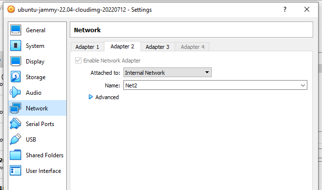

# Task 5 <br/>


Server_1 – Віртуальна машина, на якій розгорнуто ОС Linux. Int1 цієї машини в
   режимі «Мережевий міст» підключений до мережі Net1, тобто знаходиться в адресному
   просторі домашньої мережі. IP-адреса Int1 встановлюється статично відповідно до
   адресного простору, наприклад 192.168.1.200/24. Інтерфейси Int2 та Int3 відповідно
   підключено в режимі «Внутрішня мережа» до мереж Net2 та Net3.
   Client_1 та Client_2 – Віртуальні машини, на яких розгорнуто ОС Linux (бажано
   різні дистрибутиви, наприклад Ubuntu та CentOS). Інтерфейси підключені в режимі
   «Внутрішня мережа» до мереж Net2, Net3 та Net4 як показано на рисунку 1.
   Адреса мережі Net2 – 10.Y.D.0/24, де Y – дві останні цифри з вашого року
   народження, D – дата народження. <br/><br/>
   <br/>
   <br/>
   <br/>
1. На Server_1 налаштувати статичні адреси на всіх інтерфейсах<br/>
   <br/>
2. На Server_1 налаштувати DHCP сервіс, який буде конфігурувати адреси Int1
   Client_1 та Client_2. (Ubuntu file netplan)<br/><br/>
   <br/>
3. За допомогою команд ping та traceroute перевірити зв'язок між віртуальними
   машинами. Результат пояснити.
4. На віртуальному інтерфейсу lo Client_1 призначити дві ІР адреси за таким
   правилом: 172.17.D+10.1/24 та 172.17.D+20.1/24. Налаштувати маршрутизацію
   таким чином, щоб трафік з Client_2 до 172.17.D+10.1 проходив через Server_1, а до
   172.17.D+20.1 через Net4. Для перевірки використати traceroute.<br/><br/>
   <br/>
5. Розрахувати спільну адресу та маску (summarizing) адрес 172.17.D+10.1 та
      172.17.D+20.1, при чому маска має бути максимально можливою. Видалити
      маршрути, встановлені на попередньому кроці та замінити їх об’єднаним
      маршрутом, якій має проходити через Server_1.<br/>
```text
Routing in client 2
172.16.14.0/24 dev enp0s8 proto kernel scope link src 172.16.14.2
172.17.0.0/18 via 10.12.85.1 dev enp0s3

```
6. Налаштувати SSH сервіс таким чином, щоб Client_1 та Client_2 могли
   підключатись до Server_1 та один до одного.<br/>
   Server to Client1<br/>
```text
vagrant@ubuntu-jammy:~$ ssh vagrant@10.85.14.11
The authenticity of host '10.85.14.11 (10.85.14.11)' can't be established.
ED25519 key fingerprint is SHA256:wP11cor4H9Q9a8oDUxmo6w3nqeR4w76Mo1xxJNEtGbQ.
This key is not known by any other names
Are you sure you want to continue connecting (yes/no/[fingerprint])? yes
Warning: Permanently added '10.85.14.11' (ED25519) to the list of known hosts.
vagrant@10.85.14.11's password:
Last login: Sat Jul 16 01:19:13 2022 from 172.16.14.2
[vagrant@localhost ~]$
```
Server to Client2<br/>
```text


vagrant@ubuntu-jammy:~$ ssh vm3@10.12.85.10
vm3@10.12.85.10's password:
Welcome to Ubuntu 22.04 LTS (GNU/Linux 5.15.0-39-generic x86_64)

 * Documentation:  https://help.ubuntu.com
 * Management:     https://landscape.canonical.com
 * Support:        https://ubuntu.com/advantage

  System information as of Sat Jul 16 01:28:40 AM UTC 2022

  System load:  0.08447265625      Processes:               105
  Usage of /:   37.9% of 23.45GB   Users logged in:         1
  Memory usage: 65%                IPv4 address for enp0s3: 10.12.85.10
  Swap usage:   14%                IPv4 address for enp0s8: 172.16.14.2


47 updates can be applied immediately.
15 of these updates are standard security updates.
To see these additional updates run: apt list --upgradable


Last login: Fri Jul 15 22:50:10 2022 from 172.16.14.1
```
Client1 to Server.<br/>
<br/><br/>
Client1 to Client2.<br/>
<br/><br/>
Client2 to Client1.<br/>
<br/><br/>
Client2 to Server.<br/>
<br/><br/>
7. Налаштуйте на Server_1 firewall таким чином:
• Дозволено підключатись через SSH з Client_1 та заборонено з Client_2
• З Client_1 на 172.17.D+10.1 ping проходив, а на 172.17.D+20.1 не проходив.<br/><br/>
```text
I change file  /etc/ssh/sshd_config. Field ListenAddress: 10.85.14.1 (My ip in  network Net2 )    
```
8. Якщо в п.3 була налаштована маршрутизація для доступу Client_1 та Client_2 до
   мережі Інтернет – видалити відповідні записи. На Server_1 налаштувати NAT
   сервіс таким чином, щоб з Client_1 та Client_2 проходив ping в мережу Інтернет.<br/><br/>
```text
This command enables internet traffic.
iptables -t nat -A POSTROUTING -o eth1 -j MASQUERADE
```