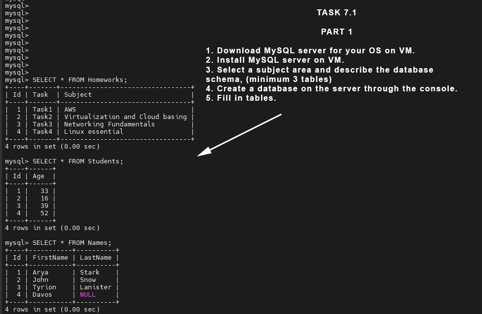
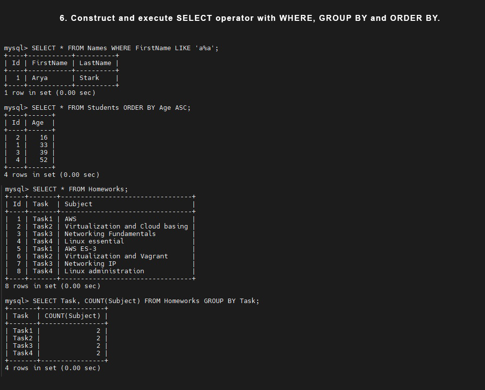
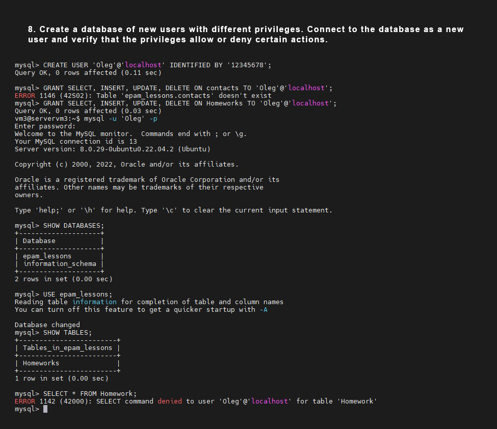
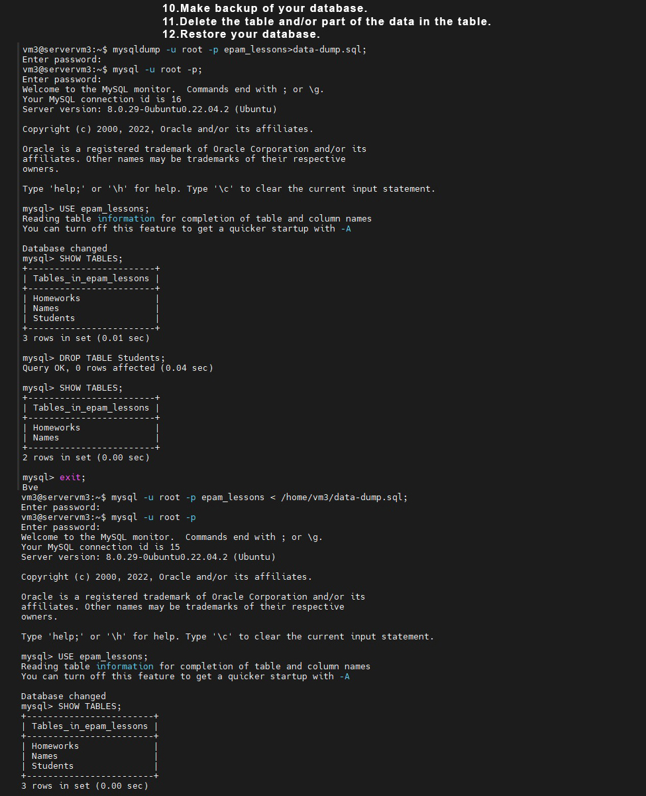
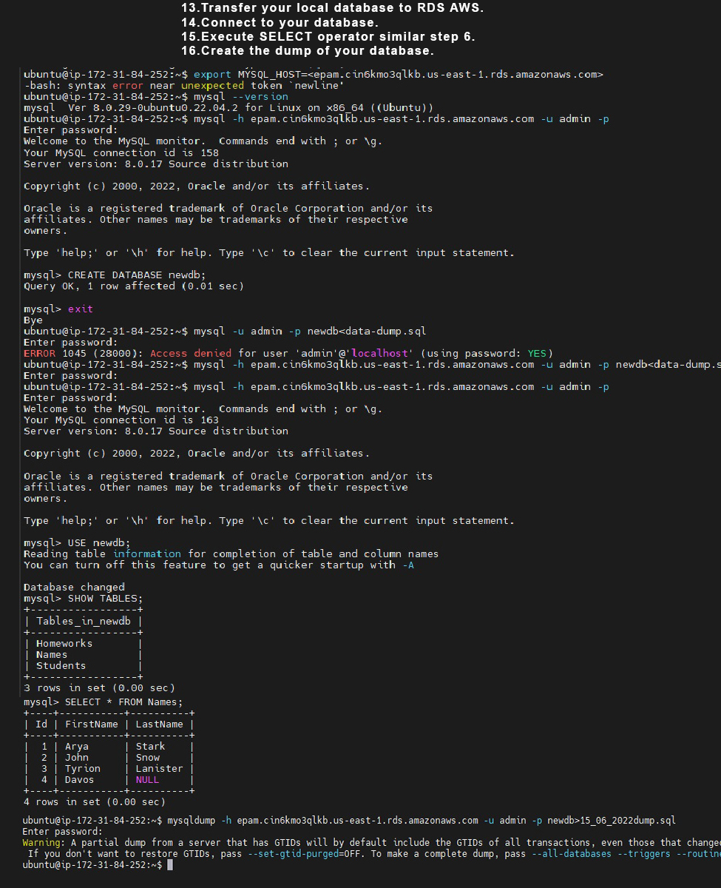
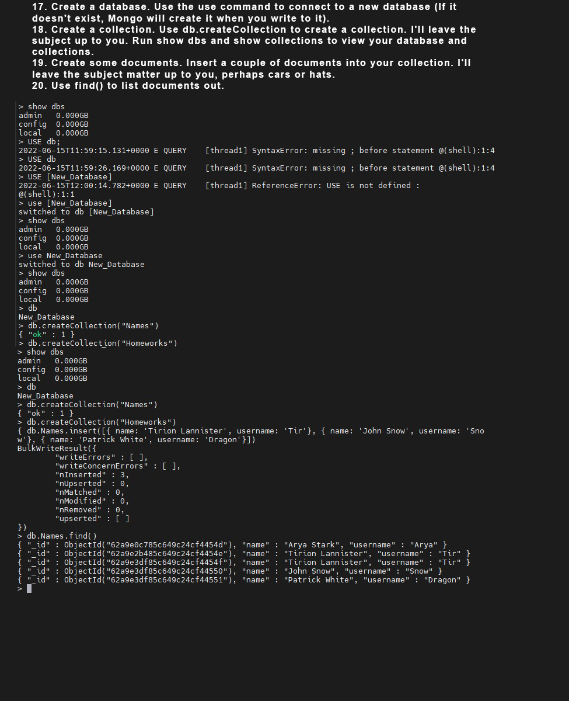

# Task 7.1 Database Administration.
### Part 1.
1. Download MySQL server for your OS on VM.
2. Install MySQL server on VM.
3. Select a subject area and describe the database schema, (minimum 3 tables)
4. Create a database on the server through the console.
5. Fill in tables.
 
 
  
6. Construct and execute SELECT operator with WHERE, GROUP BY and ORDER BY.
    
    
  
7. Execute other different SQL queries DDL, DML, DCL.  DDL – Data Definition Language
Data Definition Language (DDL) – це група операторів визначення даних.
Інакше кажучи, з допомогою операторів, які входять до цієї групи, ми визначаємо
структуру бази даних, і працюємо з об'єктами цієї бази, тобто. створюємо, змінюємо
та видаляємо їх. - ми ці оператори використовували коли створювали і видаляли таблицю, 
або базу данних в попередніх завданнях.  
   Data Manipulation Language (DML) – це група операторів для маніпуляції даними. З допомогою
цих операторів ми можемо додавати, змінювати, видаляти та вивантажувати дані з бази, тобто 
маніпулювати ними.  
SELECT - здійснює вибірку даних; 
INSERT – додає нові дані; 
UPDATE – змінює наявні дані; 
DELETE – видаляє дані.  
Ці оператори також використовувались у поппередніх завданнях.
Data Control Language (DCL) – група операторів визначення доступу до даних. Іншими словами, 
це оператори для керування дозволами, за допомогою яких ми можемо дозволяти або забороняти 
виконання певних операцій над об'єктами бази даних.  
З Операторами DCL ми будемо працювати в наступному завданні ,коли будемо призначати, або обмежувати 
доступ до бази данних іншим користувачам.  
8. Create a database of new users with different privileges. Connect to the
   database as a new user and verify that the privileges allow or deny certain
   actions.  
     

9. Make a selection from the main table DB MySQL.
### Part 2.
10. Make backup of your database.
11. Delete the table and/or part of the data in the table.
12. Restore your database.  
      
13. Transfer your local database to RDS AWS.
14. Connect to your database.
15. Execute SELECT operator similar step 6.
16. Create the dump of your database.  
      
### PART 3 – MongoDB.
17. Create a database. Use the use command to connect to a new database (If it
    doesn't exist, Mongo will create it when you write to it).
18. Create a collection. Use db.createCollection to create a collection. I'll leave the
    subject up to you. Run show dbs and show collections to view your database and
    collections.
19. Create some documents. Insert a couple of documents into your collection. I'll
    leave the subject matter up to you, perhaps cars or hats.
20. Use find() to list documents out.  
      
